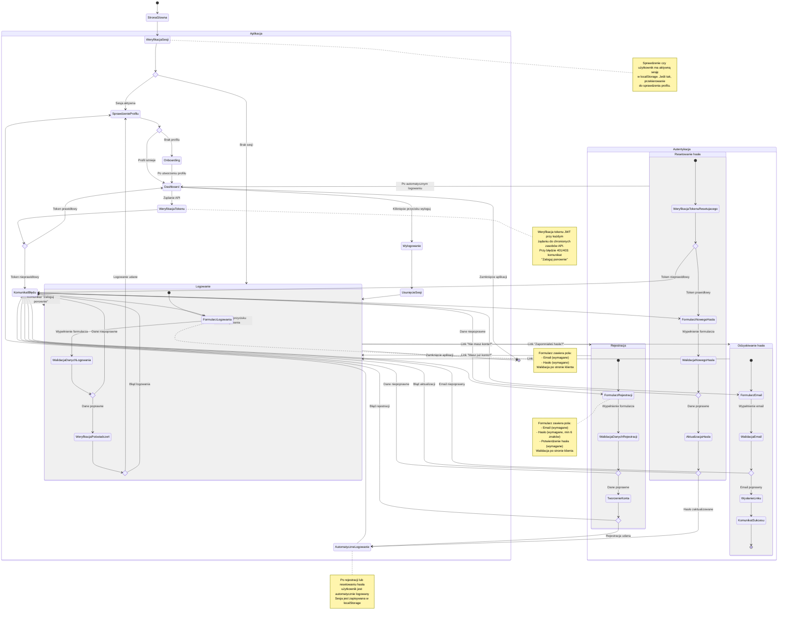

# Diagram podróży użytkownika - Moduł logowania i rejestracji

<user_journey_analysis>

## Analiza wymagań i ścieżek użytkownika

### 1. Wszystkie ścieżki użytkownika z PRD i auth-spec.md

Na podstawie analizy dokumentacji zidentyfikowano następujące ścieżki:

**US-001: Logowanie użytkownika**
- Użytkownik wchodzi na stronę logowania
- Wypełnia formularz (email, hasło)
- System weryfikuje dane
- Po sukcesie: sprawdzenie profilu → redirect do dashboard lub onboarding
- Po błędzie: wyświetlenie komunikatu błędu
- Sesja utrzymuje się między odświeżeniami
- Przy błędnym tokenie: komunikat "Zaloguj ponownie"

**US-007: Bezpieczny dostęp i uwierzytelnianie**
- Rejestracja: email, hasło, potwierdzenie hasła → automatyczne logowanie → sprawdzenie profilu
- Logowanie: email, hasło → sprawdzenie profilu → redirect
- Odzyskiwanie hasła: email → wysłanie linku → resetowanie hasła → automatyczne logowanie
- Wylogowanie: przycisk w prawym górnym rogu → usunięcie sesji → redirect do logowania
- Przycisk logowania: dla niezalogowanych w prawym górnym rogu

**Dodatkowe ścieżki z auth-spec.md:**
- Dostęp do chronionych zasobów wymaga autoryzacji
- Weryfikacja sesji przy każdym żądaniu
- Automatyczne odświeżanie tokenu
- Obsługa błędów 401/403

### 2. Główne podróże i odpowiadające im stany

**Podróż 1: Nowy użytkownik (Rejestracja)**
- Stany: StronaGłówna → Rejestracja → FormularzRejestracji → WalidacjaDanych → WeryfikacjaEmail → AutomatyczneLogowanie → SprawdzenieProfilu → Onboarding (brak profilu) / Dashboard (profil istnieje)

**Podróż 2: Powracający użytkownik (Logowanie)**
- Stany: StronaGłówna → Logowanie → FormularzLogowania → WalidacjaDanych → WeryfikacjaPoświadczeń → SprawdzenieProfilu → Dashboard / Onboarding

**Podróż 3: Odzyskiwanie hasła**
- Stany: Logowanie → OdzyskiwanieHasła → FormularzEmail → WysłanieLinku → ResetowanieHasła → FormularzNowegoHasła → AutomatyczneLogowanie → Dashboard

**Podróż 4: Dostęp do aplikacji (zalogowany)**
- Stany: StronaGłówna → WeryfikacjaSesji → Dashboard (sesja OK) / Logowanie (brak sesji)

**Podróż 5: Wylogowanie**
- Stany: Dashboard → Wylogowanie → UsunięcieSesji → Logowanie

**Podróż 6: Dostęp do chronionych zasobów**
- Stany: Dashboard → ŻądanieAPI → WeryfikacjaTokenu → Sukces (dane) / Błąd401 (redirect do logowania)

### 3. Punkty decyzyjne i alternatywne ścieżki

**Punkt decyzyjny 1: Czy użytkownik jest zalogowany?**
- Tak → Dashboard / Onboarding
- Nie → Logowanie / Rejestracja

**Punkt decyzyjny 2: Czy profil użytkownika istnieje?**
- Tak → Dashboard
- Nie → Onboarding

**Punkt decyzyjny 3: Czy dane logowania są poprawne?**
- Tak → Sprawdzenie profilu → Dashboard / Onboarding
- Nie → Komunikat błędu → FormularzLogowania

**Punkt decyzyjny 4: Czy dane rejestracji są poprawne?**
- Tak → Automatyczne logowanie → Sprawdzenie profilu
- Nie → Komunikat błędu → FormularzRejestracji

**Punkt decyzyjny 5: Czy token jest prawidłowy?**
- Tak → Dostęp do zasobów
- Nie → Komunikat "Zaloguj ponownie" → Logowanie

**Punkt decyzyjny 6: Czy token resetujący jest prawidłowy?**
- Tak → Resetowanie hasła → Automatyczne logowanie
- Nie → Komunikat błędu → OdzyskiwanieHasła

### 4. Opis celu każdego stanu

**StronaGłówna**: Punkt wejścia do aplikacji, przekierowanie na podstawie stanu autoryzacji

**Logowanie**: Strona dedykowana do logowania z formularzem email/hasło

**FormularzLogowania**: Formularz z polami email i hasło, walidacja po stronie klienta

**WeryfikacjaPoświadczeń**: Weryfikacja danych logowania przez Supabase Auth

**Rejestracja**: Strona dedykowana do rejestracji z formularzem email/hasło/potwierdzenie

**FormularzRejestracji**: Formularz z polami email, hasło, potwierdzenie hasła, walidacja

**AutomatyczneLogowanie**: Po rejestracji użytkownik jest automatycznie logowany

**SprawdzenieProfilu**: Weryfikacja czy użytkownik ma utworzony profil w bazie danych

**Dashboard**: Główny widok aplikacji dla zalogowanych użytkowników z profilem

**Onboarding**: Proces tworzenia profilu dla nowych użytkowników

**OdzyskiwanieHasła**: Strona z formularzem do wysłania linku resetującego hasło

**FormularzEmail**: Formularz z polem email do odzyskiwania hasła

**WysłanieLinku**: Wysłanie email z linkiem resetującym hasło

**ResetowanieHasła**: Strona z formularzem do ustawienia nowego hasła

**FormularzNowegoHasła**: Formularz z polami nowe hasło i potwierdzenie hasła

**WeryfikacjaSesji**: Sprawdzenie czy użytkownik ma aktywną sesję

**WeryfikacjaTokenu**: Weryfikacja tokenu JWT przy dostępie do chronionych zasobów

**Wylogowanie**: Proces zakończenia sesji i usunięcia tokenów

**UsunięcieSesji**: Czyszczenie sesji z localStorage i unieważnienie tokenów

**KomunikatBłędu**: Wyświetlenie komunikatu błędu użytkownikowi

**KomunikatSukcesu**: Wyświetlenie komunikatu sukcesu (np. po wysłaniu linku resetującego)

</user_journey_analysis>

<mermaid_diagram>

</mermaid_diagram>

## Opis diagramu

Diagram przedstawia kompleksową podróż użytkownika przez moduł logowania i rejestracji aplikacji DoFIRE. Diagram jest podzielony na główne sekcje:

### 1. Autentykacja
Zawiera cztery główne procesy:
- **Logowanie**: Proces logowania z walidacją danych i weryfikacją poświadczeń
- **Rejestracja**: Proces rejestracji z automatycznym logowaniem po sukcesie
- **Odzyskiwanie hasła**: Proces wysłania linku resetującego hasło
- **Resetowanie hasła**: Proces ustawienia nowego hasła z weryfikacją tokenu

### 2. Aplikacja
Zawiera główne stany aplikacji:
- **Weryfikacja sesji**: Sprawdzenie czy użytkownik jest zalogowany
- **Sprawdzenie profilu**: Weryfikacja czy użytkownik ma utworzony profil
- **Dashboard**: Główny widok dla zalogowanych użytkowników
- **Onboarding**: Proces tworzenia profilu dla nowych użytkowników
- **Weryfikacja tokenu**: Weryfikacja przy dostępie do chronionych zasobów
- **Wylogowanie**: Proces zakończenia sesji

### 3. Punkty decyzyjne
Diagram zawiera wiele punktów decyzyjnych (`<<choice>>`), które reprezentują:
- Walidację danych formularzy
- Weryfikację poświadczeń i tokenów
- Sprawdzenie stanu sesji i profilu użytkownika
- Obsługę błędów i sukcesów

### 4. Alternatywne ścieżki
Diagram pokazuje wszystkie możliwe ścieżki:
- Sukces i błędy w każdym procesie
- Przekierowania między stanami
- Obsługę błędów autoryzacji (401/403)
- Automatyczne logowanie po rejestracji i resetowaniu hasła

### 5. Zgodność z wymaganiami
Diagram jest w pełni zgodny z:
- **US-001**: Logowanie użytkownika z trwałą sesją
- **US-007**: Rejestracja, logowanie, odzyskiwanie hasła, wylogowanie
- Wszystkie scenariusze użytkownika z auth-spec.md

Diagram skupia się na ścieżkach biznesowych i doświadczeniu użytkownika, a nie na szczegółach technicznych implementacji.

