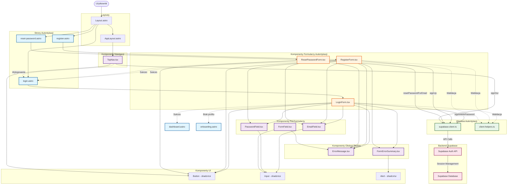

# Diagram Architektury UI - Moduł Logowania i Rejestracji

<architecture_analysis>

## Analiza komponentów

### Obecne komponenty (przed wdrożeniem US-007):

1. **Strony Astro:**
   - `login.astro` - Strona logowania (obecnie magic link)
   - `dashboard.astro` - Dashboard użytkownika
   - `onboarding.astro` - Proces onboardingu
   - `index.astro` - Strona główna

2. **Komponenty React:**
   - `LoginForm.tsx` - Formularz logowania (magic link/OTP)
   - `EmailField.tsx` - Pole email z walidacją
   - `ErrorMessage.tsx` - Komponent wyświetlania błędów
   - `FormField.tsx` - Uniwersalne pole formularza
   - `FormErrorSummary.tsx` - Podsumowanie błędów formularza
   - `TopNav.tsx` - Nawigacja górna z przyciskiem wylogowania

3. **Layouts:**
   - `Layout.astro` - Podstawowy layout HTML
   - `AppLayout.astro` - Layout z nawigacją dla zalogowanych użytkowników

4. **Pomocnicze:**
   - `client-helpers.ts` - Funkcje pomocnicze do autoryzacji (getAuthToken)
   - `supabase.client.ts` - Klient Supabase

### Komponenty wymagane po wdrożeniu US-007:

1. **Nowe strony Astro:**
   - `register.astro` - Strona rejestracji
   - `reset-password.astro` - Strona resetowania hasła

2. **Nowe komponenty React:**
   - `RegisterForm.tsx` - Formularz rejestracji (email, hasło, potwierdzenie hasła)
   - `PasswordField.tsx` - Pole hasła z walidacją
   - `ResetPasswordForm.tsx` - Formularz resetowania hasła
   - Zaktualizowany `LoginForm.tsx` - Zmiana z magic link na logowanie z hasłem

3. **Aktualizacje istniejących:**
   - `TopNav.tsx` - Dodanie przycisku logowania dla niezalogowanych użytkowników
   - `login.astro` - Aktualizacja do logowania z hasłem

## Przepływ danych:

1. **Rejestracja:**
   - Użytkownik → `register.astro` → `RegisterForm` → Supabase Auth → Przekierowanie do logowania

2. **Logowanie:**
   - Użytkownik → `login.astro` → `LoginForm` → Supabase Auth → Sprawdzenie profilu → Dashboard/Onboarding

3. **Reset hasła:**
   - Użytkownik → `reset-password.astro` → `ResetPasswordForm` → Supabase Auth → Przekierowanie do logowania

4. **Wylogowanie:**
   - Użytkownik → `TopNav` → Supabase Auth → Przekierowanie do logowania

## Funkcjonalność komponentów:

- **LoginForm**: Walidacja email i hasła, obsługa błędów autoryzacji, przekierowania
- **RegisterForm**: Walidacja email, hasła i potwierdzenia hasła, tworzenie konta
- **ResetPasswordForm**: Wysyłanie linku resetującego hasło
- **EmailField**: Walidacja formatu email, obsługa błędów
- **PasswordField**: Walidacja siły hasła, ukrywanie/pokazywanie hasła
- **FormField**: Uniwersalne pole z etykietą, błędami i helper text
- **ErrorMessage**: Wyświetlanie komunikatów błędów (inline/banner)
- **FormErrorSummary**: Podsumowanie wszystkich błędów formularza
- **TopNav**: Nawigacja, przycisk logowania/wylogowania w zależności od stanu sesji

</architecture_analysis>

<mermaid_diagram>

</mermaid_diagram>
